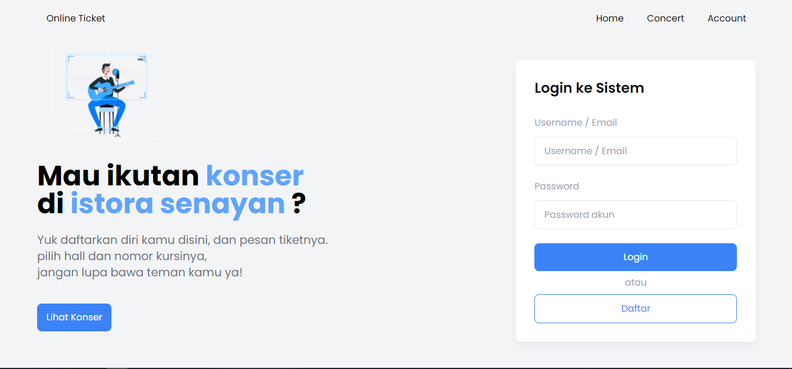
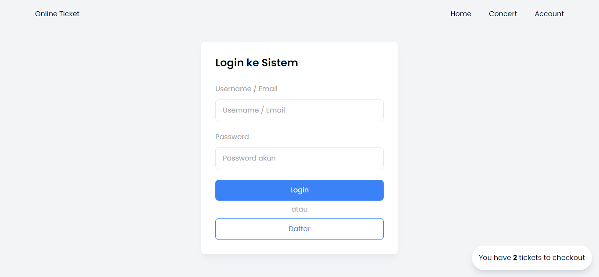
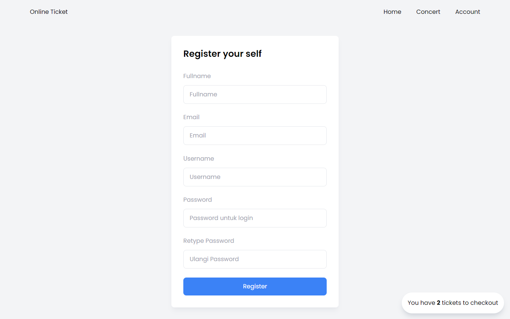
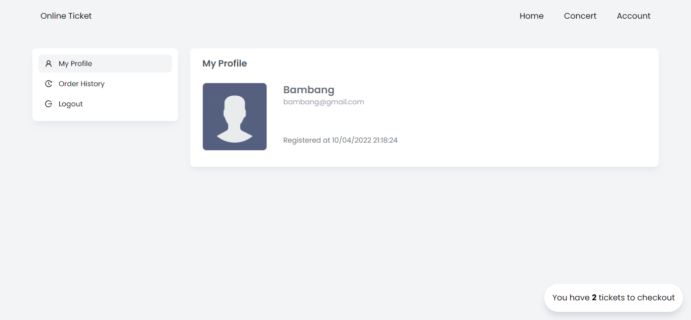
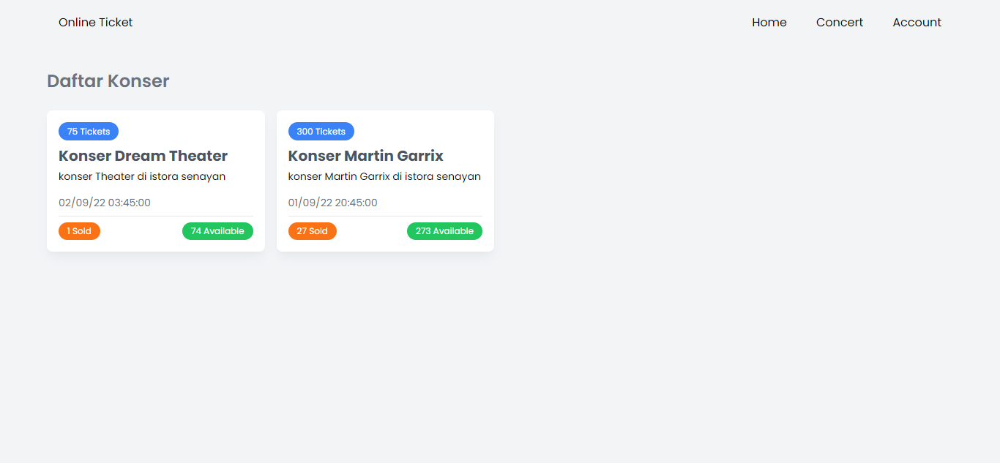
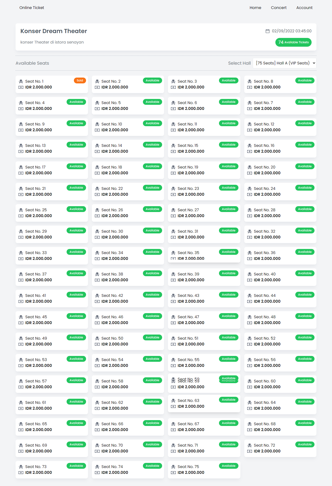
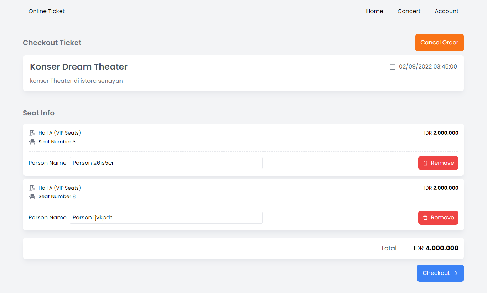
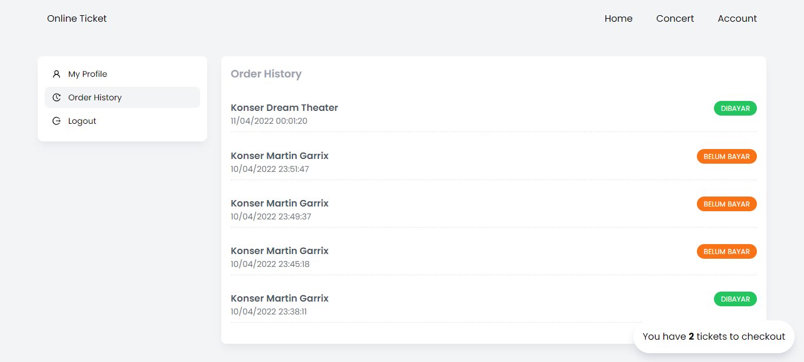

# Online Ticket Booking

berikut URL yang dapat digunakan untuk membuka dokumentasi API dan demo.
project yang dikerjakan belum selesai 100%, karena belum sempat membuat halaman admin. namun untuk proses checkout hingga payment dapat dites pada **demo app**

-- _sistem payment yang digunakan pada aplikasi ini merupakan payment gateway_ **_API DUITKU sandbox mode_**

## Step demo aplikasi

- Register akun
- Login
- Pergi ke menu concert
- Pilih concert
- Pilih Hall
- Pilih Ticketnya
- Pergi ke halaman checkout \*\*(ada floating di pojok kanan bawah
- Isi nama orang pada tiket tersebut
- Klik Checkout
- Selesaikan pembayaran di payment gateway **DUITKU**
- Lihat order history

-- _untuk auto status dibayar pilih klikbca, sisanya pending payment_

## URL

- [Database Design](https://dbdiagram.io/d/62430858bed61838731c70a0)
- [API Documentation](https://documenter.getpostman.com/view/9344602/UVyxQtsq)
- [Back-End Source Code](https://github.com/angganix/OnlineConcertBooking)
- [Front-End Source Code](https://github.com/angganix/OnlineBookingTicket-FE)
- [Demo App](http://teknix.my.id:3000)

## Screenshot

- Halaman Home
  
- Halaman Login
  
- Halaman Register
  
- Halaman Account
  
- Halaman Concert
  
- Halaman Detail Concert
  
- Halaman Checkout
  
- Halaman Order History
  
